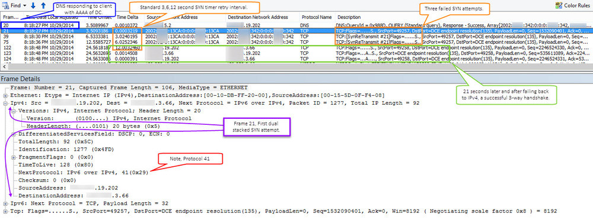
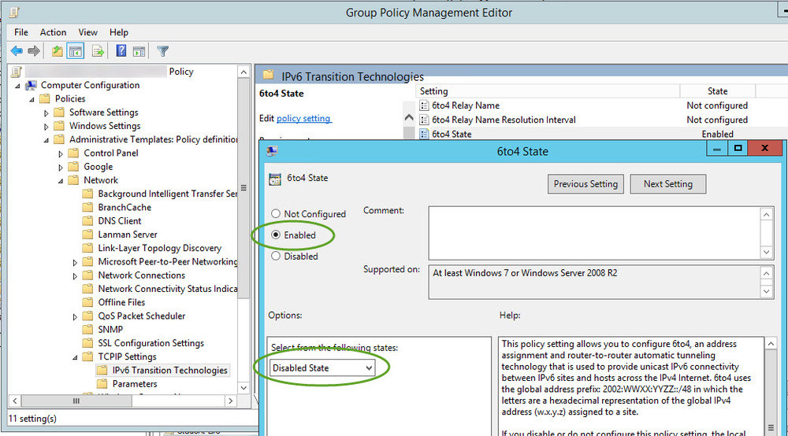

A few years ago I was pulled into an issue because "AD was slow". The environment that was having issues was behind a firewall, separated from the AD environment. The firewall was configured to NAT all internal public address to a single public address. Although all necessary pokes were in place to allow communication from inside the firewall to the AD environment outside the firewall, clients still experienced 1-3 minute delays when interacting with AD related services. I'm considering AD related services anything requiring AD to function, from DC locator to Kerberos for authentication (e.g. file share access, print server access, Exchange\Outlook). In the end I found that clients were attempting their initial communication with DCs by tunneling IPv6 traffic within IPv4 (i.e. 6to4). This communication was dropped by the firewall. Once failing back to IPv4 and after the accumulated SYN timer retries (21+ seconds) the clients were able to communicate. Disabling 6to4 on the clients via GPO resolved the issue.

The following details my findings and analysis through a packet capture. I was able to drop a client in the network behind the firewall which allowed me to capture traffic during delays. Delays were viewed during logon, the mapping of drives, and when adding AD users to client local groups. Other symptoms included credential pop-ups in Outlook\Exchange that would not accept credentials and slowness with RSAT (dsa, dssite, gpmc etc).

The screen capture above shows the capture viewed in NetMon. The frames selected in orange show my clients initial attempt to communicate with the domain controller via 6to4 (indicated by the dual protocols pointed out in purple). The frames selected in orange show the expected SYN retry time intervals of 3 6 and 12 seconds. Once 21 seconds (3 attempts) had elapsed the client then attempted without 6to4. This communication is selected in green and shows your typical successful TCP 3-way handshake SYN, ACK-SYN, ACK. Depending on what the client was doing with AD this process (at least in my findings) repeated itself, sometimes causing delays up 3 minutes. This kinda makes sense when you start to think about sessions and each process working it's way up the stack, unaware of what another session attempted and failed.

So, why does this happen when traversing a firewall? RFC6343 "Advisory Guidelines for 6to4 Deployment" states two possible reasons for this. The first being the use of private IP addresses behind the firewall. This matters because of how the 6to4 IPv6 address that is tunneled/encapsulated in IPv4 is generated. The client IPv6 addressed used by 6to4 is generated from the clients IPv4 address. That said, if that address is private then it's not necessarily unique. Destination clients receiving the 6to4 communication, once worked up the stack, would be unable to differentiate between one IPv6 session and another. The second possible reason are firewalls blocking protocol 41 either outbound on inbound (destination reply).

In my case they were not using private IP addresses on the inside of the firewall. I'm going with the blocking of protocol 41 as the issue. Protocol 41 is indicated in red via the screen capture above. In a frame not leveraging 6to4 this protocol would be 6 'TCP'. To fix this issue I disabled 6to4 via GPO.

